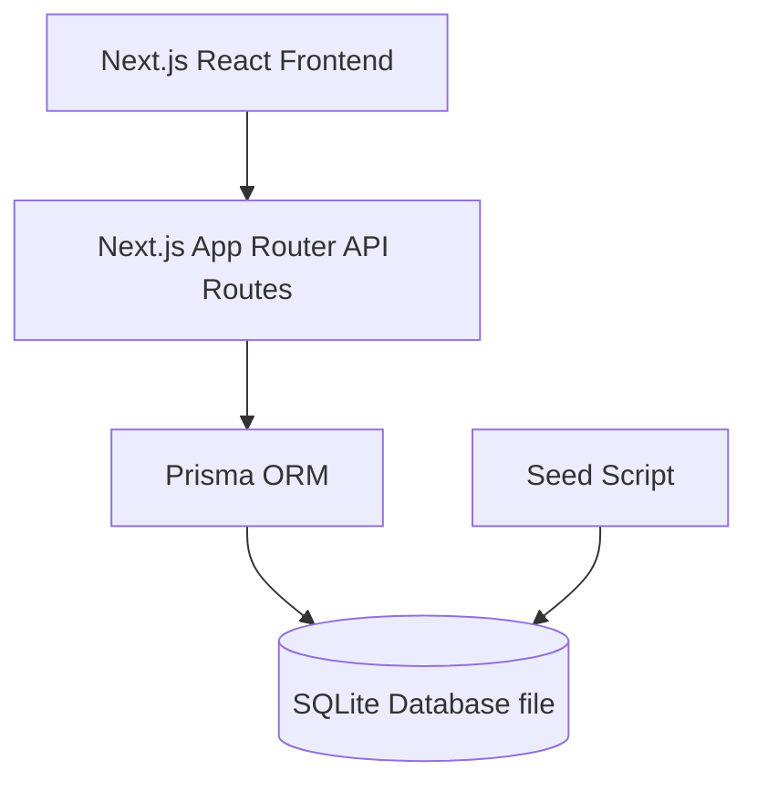

# Implementation Plan: ACME Salary Management System

This plan outlines the architecture, database schema, API design, UI layout, and testing strategy for building a salary management application using Next.js (App Router), SQLite, and Prisma.

---

## User Review Required

> [!IMPORTANT]
> - **Unified Database & Backend**: We are proposing a Next.js fullstack application. This allows us to write frontend React components and backend API handlers in a single repository with shared TypeScript types, ensuring high developer velocity and ease of deployment.
> - **Performance with 10k Records**: Rendering 10,000 rows in the browser directly will crash/freeze the browser. The frontend table will implement strict server-side search, filtering, and pagination.
> - **Currency Normalization**: All analytics will normalize local salaries to **USD** using a seeded exchange rate table to provide consistent charts, while displaying the local currency on the employee profile.

---

## Proposed Architecture & Tech Stack

- **Frontend**: Next.js (App Router, React, CSS Modules).
- **Backend API**: Next.js Route Handlers (`app/api/...`).
- **Database**: SQLite (managed with Prisma ORM).
- **Charts**: Recharts (interactive and modern React chart library).
- **Testing**: Vitest for fast, deterministic unit & API integration testing.

---

## Database Schema (Prisma)

### `Employee`
*   `id`: String (UUID, Primary Key)
*   `firstName`: String
*   `lastName`: String
*   `email`: String (Unique)
*   `gender`: String (e.g., Male, Female, Non-binary)
*   `jobTitle`: String
*   `department`: String
*   `country`: String
*   `currency`: String (e.g., USD, EUR, INR, GBP, JPY)
*   `salary`: Float (Current salary in local currency)
*   `previousSalary`: Float (Nullable, for simple audit comparison)
*   `salaryUpdatedAt`: DateTime (Default now, updated on salary patch)
*   `createdAt`, `updatedAt`: DateTime

### `ExchangeRate`
*   `id`: String (Primary Key)
*   `fromCurrency`: String (Unique, e.g., INR)
*   `toCurrency`: String (e.g., USD)
*   `rate`: Float (Exchange rate multiplier)

---

## API Endpoints

### 1. `GET /api/employees`
*   **Query Params**: `page` (default 1), `limit` (default 20), `search` (name/email), `department`, `country`.
*   **Returns**: `{ data: Employee[], totalPages: number, totalCount: number, page: number }`.

### 2. `POST /api/employees`
*   **Body**: `firstName`, `lastName`, `email`, `gender`, `jobTitle`, `department`, `country`, `currency`, `salary`.
*   **Returns**: The created `Employee` object.

### 3. `PATCH /api/employees/[id]`
*   **Body**: `salary` (updates current salary, moves old salary to `previousSalary`, updates `salaryUpdatedAt`).
*   **Returns**: The updated `Employee` object.

### 4. `DELETE /api/employees/[id]`
*   **Returns**: Success message.

### 5. `GET /api/dashboard`
*   **Returns**: Aggregated metrics:
    *   `totals`: `{ totalPayrollUSD: number, averageSalaryUSD: number, medianSalaryUSD: number, totalHeadcount: number }`
    *   `byDepartment`: `{ department: string, averageSalaryUSD: number, headcount: number }[]`
    *   `byCountry`: `{ country: string, averageSalaryUSD: number, totalPayrollUSD: number, headcount: number }[]`
    *   `genderGap`: `{ department: string, maleAvgUSD: number, femaleAvgUSD: number, gapPercentage: number }[]`

---

## UI Components & Design System

1.  **Dashboard Page (`/` or `/dashboard`)**:
    *   **KPI Cards**: Large, glassmorphic cards showing Total Payroll (USD), Avg Salary, Median Salary, and Total Employees.
    *   **Department Analytics**: Bar charts showing average salary and employee count.
    *   **Country Breakdown**: Interactive map/chart or table with payroll per country.
    *   **Interactive Filters**: Filter entire dashboard by Country or Department.
2.  **Directory Page (`/employees`)**:
    *   Search input with debounce.
    *   Dropdown filters for Country and Department.
    *   Clean, responsive, data-dense table with sorting.
    *   Pagination controls (Previous, Page Numbers, Next).
    *   "Add Employee" trigger.
3.  **Employee Details / Actions**:
    *   Modal to edit salary (shows comparison between current and new salary).
    *   On-screen verification messages.

---

## Verification Plan

### Automated Tests
- We will set up **Vitest** for testing:
  - Seeder validation: Test that the seeder creates exactly 10,000 employees with valid data distributions.
  - API Routes: Test CRUD operations (create, update salary, delete, search/pagination).
  - Calculation logic: Test currency conversions and dashboard aggregation functions.

### Manual Verification
- We will run the dev server and verify:
  - Initial load performance (ensure 10k rows is instant due to server-side pagination).
  - Dashboard interactive chart loads.
  - CRUD operations successfully reflect in the SQLite database file and database state.
